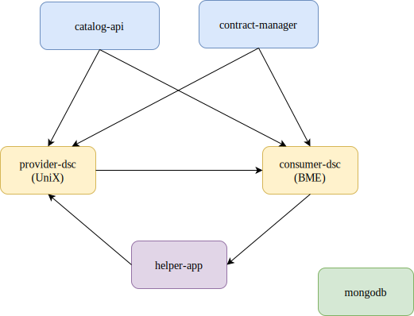
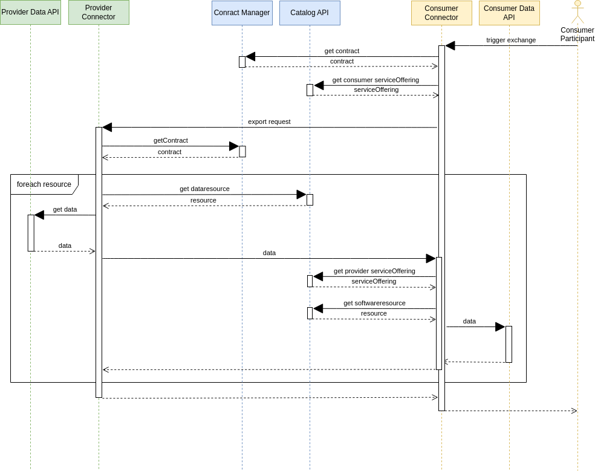

# Prometheus-X (PTX) Demo Exchange

This repository helps to set up a basic Prometheus-X environment. It contains a Postman collection and environment to set up and run the exchange.

The demo is based on the **B2B exchange, triggered by the consumer** (the exchange can be triggered by both sides). Please note, this demo **does not include policies or consent handling**.

## Setup dataspace environment

To set up the environment, you need to clone this repository along with three other repositories:

1. **ptx-demo-exchange** (this repository)
2. **dataspace-connector**
3. **catalog-api**
4. **contract-manager**

I have forked the original repositories to maintain compatibility with the demo and applied necessary fixes and changes.

### Cloning the Repositories

You can clone the repositories with the working branches as follows:

#### This Repository
```bash
git clone -b main https://github.com/botondklenk/ptx-demo-exchange.git
```

#### Dataspace Connector
```bash
git clone -b demo-exchange https://github.com/botondklenk/ptx-dataspace-connector.git
```

#### Catalog API
```bash
git clone -b demo-exchange https://github.com/botondklenk/ptx-catalog-api.git
```

#### Contract Manager
```bash
git clone -b demo-exchange https://github.com/botondklenk/ptx-contract-manager.git
```

### Changes in the Repositories

If you want to see the changes I made in the repositories, you can check the following links:

In the catalog-api there is just one small fix:
[commit](https://github.com/botondklenk/ptx-catalog-api/commit/1a2262e15c1d3e76c79a26d27e57a55aa79076a3)

In the dataspace-connector there are more changes and fixes:
[PR that contains the commits](https://github.com/botondklenk/ptx-dataspace-connector/pull/2/commits)

### Starting the Services

After cloning the repositories, navigate to the `ptx-demo-exchange` directory and start the services using Docker Compose:

```bash
cd ptx-demo-exchange
docker compose build
docker network create ptx
docker compose up -d
```

> **Note**:  
> If you're using Docker on Windows, you may need to change the line endings of the `ptx-dataspace-connector/docker/scripts/start.sh` script to LF.

### Services

The following services will be started:

- **consumer-dsc**: The consumer-side Dataspace Connector.
- **provider-dsc**: The provider-side Dataspace Connector.
- **catalog-api**: The Catalog API service.
- **contract-manager**: Manages contracts within the environment.
- **mongodb**: A shared MongoDB instance for simplicity.
- **helper-app**: A helper application for additional functionalities. The main purpose is to imitate the data source and the data consumer.



## Postman Collection

In the `postman` directory, you can find a Postman collection and environment to interact with the services. You can import these files into a Postman workspace to run the collection.

> **Note**:  
> You need to select the enviroment in the top right corner.

### Collection Overview

The Postman collection includes the following main sections:

1. **Setup Catalog**: 
    - Get category ID (this is done by the helper app because the Catalog API does not support category creation)

2. **Setup Provider in Catalog**: 
    - Register provider participant
    - Login provider
    - Create data resource
    - Create representation for data resource
    - Create service offering

3. **Setup Consumer in Catalog**: 
    - Register consumer participant
    - Login consumer
    - Create software resource
    - Create representation for software resource
    - Create service offering

4. **Setup Provider Connector**: 
    - Login default
    - Update configuration
    - Login with updated configuration

5. **Setup Consumer Connector**: 
    - Login with default configuration
    - Update configuration
    - Login with updated configuration

6. **Setup Contract**: 
    - Create contract

7. **Trigger Exchange**: 
    - Trigger data exchange between consumer and provider

Each request is pre-configured with necessary scripts to automate the setup and interaction with the services.

### Exchange Flow




